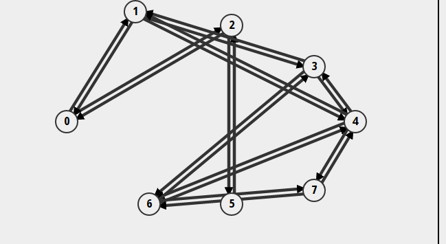

# Busca em Largura (Breadth-fist search - BFS)
_Em uma busca em largura são percorridos primeiros os vertices adjacentes_

- Observações:
  - Um vértice v é alcançável a partir de um vértice s em  um grafo G se existe um caminho de s a v em G.
  - Se não existe caminho de s a v, então v é inalcançável, logo tem distância é ∞ (infinita).

- Execução:
  - A busca em largura recebe um grafo G = (V, E) e um vértice especificado **s** chamado **fonte** (source).
  - Percorre todos os vértices alcaçáveis a partir de **s** em ordem de distância deste. Vértices a mesma distância podem ser percorridos em qualquer ordem.
  - Constrói a **árvore de busca em largura** com a raiz **s**. Cada caminho de **s** a um vértice **v** nesta árvore corresponde a um **caminho mais curto** de **s** a **v**.
  - Inicialmente a **árvore de busca em largura** contém apenas o vértice fonte **s**.
  - Para cada vizinho **v** de **s**, o vértice **v** e a aresta (**s**, **v**) são acrescentados a árvore.
  - O processo é repetido para os vizinhos de **s** e assim por diante, até que todos os vértices atingiveis por **s** sejam inseridos na árvore.
  - Este processo é implementado através de um **fila** Q.

- Simplificando:  
  _A busca atribui cores a cada vértice para facilitar o entendimento_
  - **Branca**: Vértice não visitado (Inicialmente todos os vértices são brancos).
  - **Cinza**: Visitado pela primeira vez.
  - **Preta**: Teve seus visinhos visitados.

- Complexidade:
  - A inicialização consome tempo Θ(V).
  - Depois que um vertice deixa de ser branco, ele não volta a ser branco novamente. Assim, cada vertice é inserido na fila Q no maximo uma vez. Cada operação sobre a fila consome tempo Θ(1) resultando em um total de O(V).
  - Em uma lista de adjacencia, cada vértice é percorrido apenas uma vez. A soma dos comprimentos das listas é Θ(E). Assim, o tempo gasto para percorrer as listas é O(E).
  Logo a Complexidade de tempo da BFS é O(V + E).

- Exemplo:  
  - Para visualizar um exemplo acesse [VisuAlgo](https://visualgo.net/pt/dfsbfs)
  - Clique na opção exemplos de grafo
  - Recomendado ver todas as execuções mas se precisar somente de uma use o grafo CP3 4.3

- Implementação
  - Grafo utilizado:
    
  - [BFS em C++](main.cpp)
